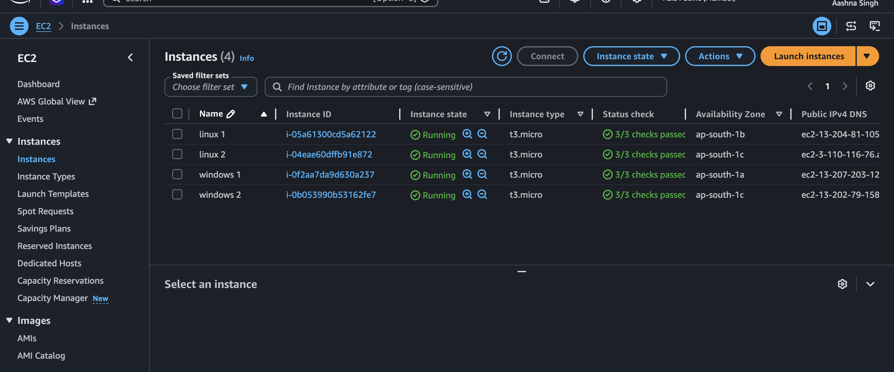
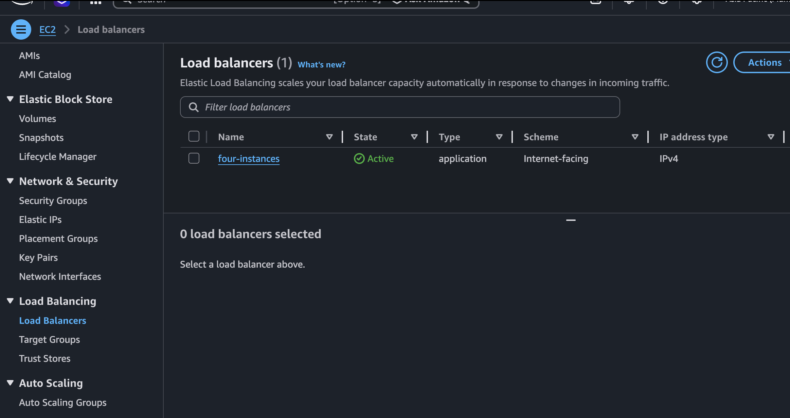
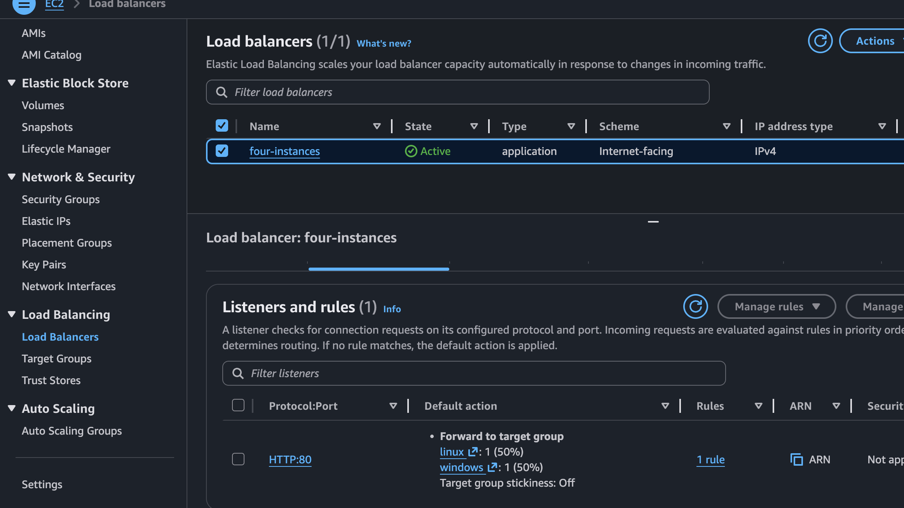
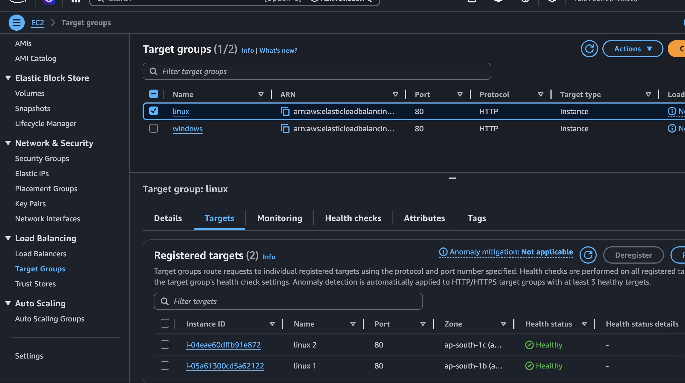
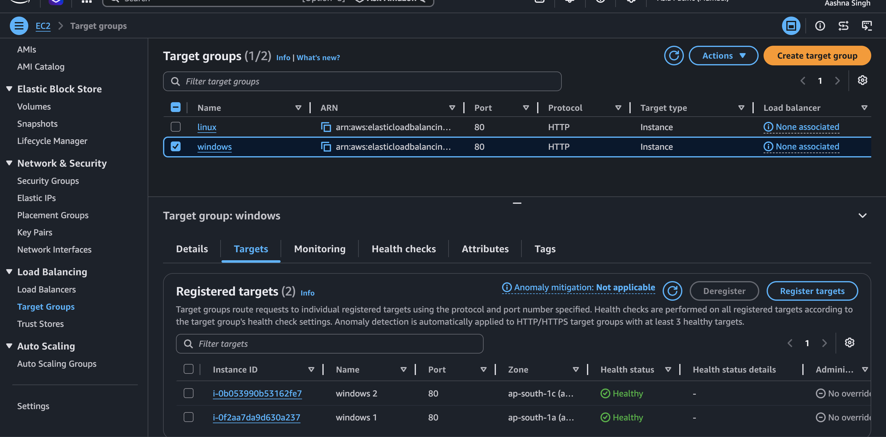
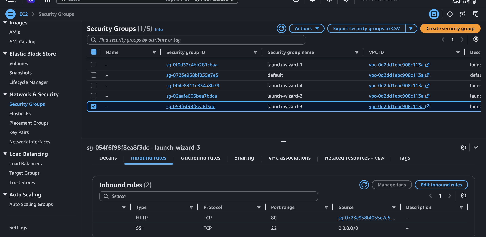
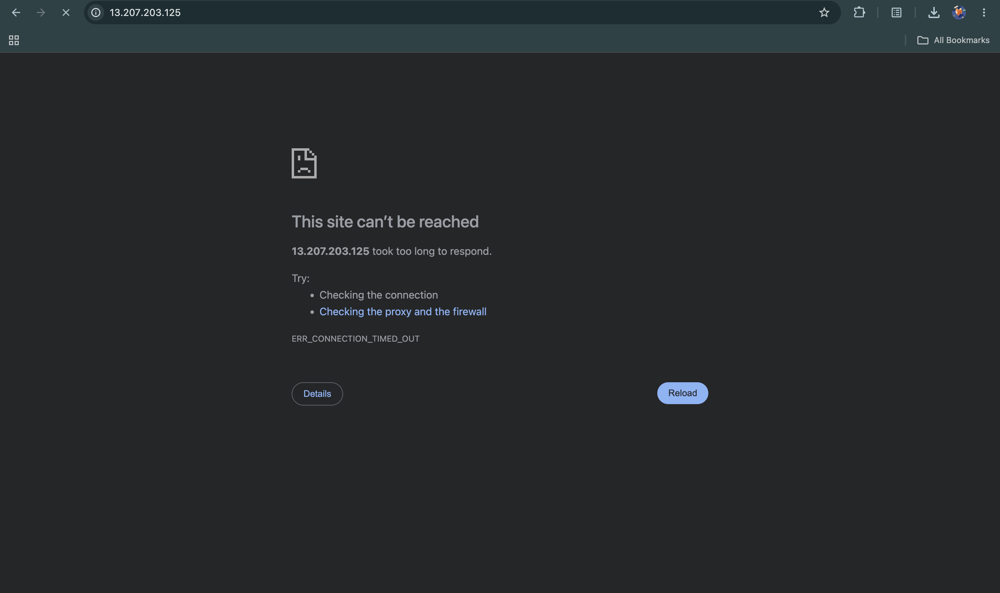

# ⚖️ Multi-tier Load Balanced Architecture on AWS

> An Application Load Balancer distributing traffic across **4 EC2 instances** (2 Linux + 2 Windows) using **separate target groups per OS** — with security group chaining to ensure instances are only reachable through the ALB.

[](https://aws.amazon.com)
[](https://aws.amazon.com/ec2)
[](https://aws.amazon.com/elasticloadbalancing)
[](https://aws.amazon.com)

---

## 🏗️ Architecture

```
Internet
    │
    │  HTTP:80
    ▼
┌─────────────────────────────────┐
│   Application Load Balancer     │
│   (Internet-facing, IPv4)       │
│                                 │
│   Listener: HTTP:80             │
│   ├── linux-tg    → 50%        │
│   └── windows-tg  → 50%        │
└────────────┬────────────────────┘
             │
      Security Group Chaining
      (Instances only accept
       traffic from ALB SG)
             │
    ┌────────┴────────┐
    │                 │
┌───▼────┐       ┌────▼───┐
│linux-tg│       │windows │
│        │       │  -tg   │
├────────┤       ├────────┤
│Linux 1 │       │Win 1   │
│Linux 2 │       │Win 2   │
│ap-s-1b │       │ap-s-1a │
│ap-s-1c │       │ap-s-1c │
└────────┘       └────────┘
```

**Traffic flow:**
1. User hits the ALB DNS on port 80
2. ALB listener evaluates the rule — forwards to both target groups at **50/50**
3. Each target group round robins between its 2 instances
4. Instances accept traffic **only from the ALB security group** — direct IP access is blocked

---

## 📸 Project Screenshots

### All 4 Instances Running


### ALB Active


### Listener Rule — 50/50 Split


### Linux Target Group — Both Healthy


### Windows Target Group — Both Healthy


### Security Group — ALB as Only Source


### Direct IP Access — Blocked ❌


---

## ☁️ AWS Services Used

| Service | Purpose |
|---|---|
| **EC2 (t3.micro)** | 4 virtual servers — 2 Amazon Linux 2, 2 Windows Server 2022 |
| **Application Load Balancer** | Distributes incoming HTTP traffic across target groups |
| **Target Groups** | Separate groups for Linux and Windows instances with health checks |
| **Security Groups** | Controls inbound/outbound traffic — chained between ALB and instances |
| **VPC** | Isolated network with instances spread across 3 availability zones |

---

## 🔐 Security Design

This project follows the **least privilege** principle for network access:

**ALB Security Group inbound:**
```
HTTP  port 80   → 0.0.0.0/0  (accepts traffic from internet)
```

**EC2 Instance Security Group inbound:**
```
HTTP  port 80   → ALB Security Group ID  (ONLY from ALB, not internet)
SSH   port 22   → 0.0.0.0/0             (management access)
```

This means even if someone finds your EC2 instance's public IP, they **cannot reach it directly** — all traffic must go through the ALB. The blocked IP screenshot proves this works.

---

## ⚖️ How Load Balancing Works Here

The ALB listener has one rule:

```
IF: any request comes in on port 80
THEN: forward to:
  - linux-tg   (weight: 1) → 50%
  - windows-tg (weight: 1) → 50%
```

Within each target group, the ALB uses **round robin** to alternate between the two instances. With stickiness off, every refresh hits a different server — you can see this in the screen recording where the page changes color on each refresh.

---

## 🗺️ Instance Distribution

| Instance | OS | Target Group | Availability Zone |
|---|---|---|---|
| linux 1 | Amazon Linux 2 | linux-tg | ap-south-1b |
| linux 2 | Amazon Linux 2 | linux-tg | ap-south-1c |
| windows 1 | Windows Server 2022 | windows-tg | ap-south-1a |
| windows 2 | Windows Server 2022 | windows-tg | ap-south-1c |

Instances are spread across **3 availability zones** — if one AZ goes down, traffic automatically routes to healthy instances in other zones.

---

## 🔑 Key Concepts Demonstrated

- **Application Load Balancer** — layer 7 load balancing with path/host based routing capability
- **Target groups** — logical grouping of instances with independent health checks per OS type
- **Security group chaining** — instances locked down to only accept traffic from ALB, not public internet
- **Multi-AZ deployment** — instances spread across availability zones for high availability
- **Health checks** — ALB continuously monitors instance health and stops routing to unhealthy targets
- **Weighted routing** — traffic split controlled by target group weights (50/50 here)

---

## 📁 Repo Structure

```
aws-alb-4-instances/
│
├── linux1.html       ← Served by Linux instance 1 (green)
├── linux2.html       ← Served by Linux instance 2 (blue)
├── windows1.html     ← Served by Windows instance 1 (purple)
├── windows2.html     ← Served by Windows instance 2 (orange)
│
├── docs/
│   ├── ec2.png                      ← All 4 instances running
│   ├── alb.png                      ← ALB active
│   ├── alb_details.png              ← ALB configuration details
│   ├── alb_listener_rule.png        ← 50/50 listener rule
│   ├── linux_tg_heath_check.png     ← Linux target group healthy
│   ├── windows_tg_health_check.png  ← Windows target group healthy
│   ├── tg.png                       ← Both target groups
│   ├── sg_showing_alb_sg.png        ← Security group chaining
│   ├── ip_not_accessed_directly.png ← Direct IP blocked proof
│   ├── linux1.png                   ← Linux 1 serving page (green)
│   ├── linux2.png                   ← Linux 2 serving page (blue)
│   ├── windows1.png                 ← Windows 1 serving page (purple)
│   └── windows2.png                 ← Windows 2 serving page (orange)
│
└── README.md
```

---

## 🧹 Cleanup (to avoid charges)

> ⚠️ Windows EC2 instances are **not free tier eligible** — always delete after use!

Delete in this order to avoid dependency errors:

1. **Delete the ALB** — EC2 → Load Balancers → Actions → Delete
2. **Delete Target Groups** — EC2 → Target Groups → Actions → Delete
3. **Terminate all 4 instances** — EC2 → Instances → Instance State → Terminate

---

## 📚 What I Learned

- How ALB listener rules work and how to configure weighted target group routing
- The difference between ALB (layer 7) and NLB (layer 4) and when to use each
- Why security group chaining is better than opening instances to `0.0.0.0/0`
- How health checks work and what happens when an instance fails one
- How multi-AZ deployment protects against availability zone failures
- Configuring IIS on Windows Server vs Apache on Amazon Linux for web serving

---
